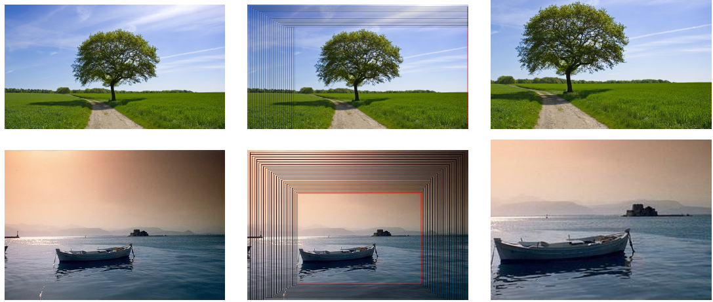
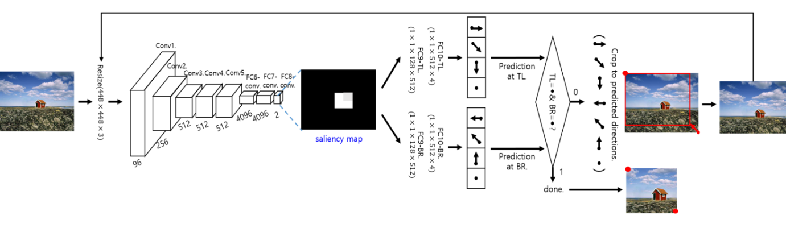

# Photo Recomposition Using Repeated Cropping #
This framework iteratively predicts cropping directions for a given photo, generating an aesthetically enhanced photo in terms of composition. 

## Introduction ##
The overall framework is inspired from [\[1\]](#references), which estimates an exact object bounding box, but we have a different goal to find a bounding box satisfying the composition rules. We estimate an optimal bounding box by aggregating many weak predictions for better image composition derived from a CNN. The network outputs two predictions for moving the top-left (TL) and the bottom-right (BR) corners of the input image. We then crop the image by moving the two corners in the predicted directions with a fixed length. By repeating the prediction and cropping, we can produce the recomposed image following photo composition guidelines (e.g., rule of thirds, salient object size).  
  
For more details regarding this technique, please refer to http://sunw.csail.mit.edu/abstract/CNN_based_Repeated.pdf  
  
* Examples of repeated cropping procedure  
  

## Files ##
* [main_using_saliency.lua](Repeated%20Cropping/main_using_saliency.lua) : Training Code
* [inference_dir.lua](Repeated%20Cropping/inference_dir.lua) : Test Code

## How to Use ##

* Test Function Usage  
```
th inference_dir.lua  –net model/repeated-epoch-40.net  –dir <your test_directory_path>
```

## Neural Network Framework ##
We use the VGG-M network [\[2\]](#references) as our base structure. Instead of directly using a pretrained network for cropping direction prediction, we first transform the VGG-M network into a fully convolutional network (FCN-VGG-M) by replacing the fully connected layers as covolution layers, in order to obtain the saliency map of the input image. FCN-VGG-M generates a 8x8 saliency map representing the high-level structural information of the scene. We then append two fully-connected layers to FCN-VGG-M, where the layers are divided into two branches. Each branch predicts a cropping direction of the top-left or bottom-right corner of the input image.




## Requirements ##
* Linux OS
* Torch7
  * Installation guide in [English](http://www.jetsonhacks.com/2015/05/20/torch-7-scientific-computer-framework-with-cudnn-nvidia-jetson-tk1/) and [Korean](http://www.whydsp.org/279)
* CUDA <= 7.5

## License ##

This software is being made available for research purpose only. Check [LICENSE](LICENSE) file for details.  
  
If you use this code in a publication, please cite our paper.  
  
```
    @inproceedings{hong2017cnnbased,
       title     = {CNN based Repeated Cropping for Photo Composition Enhancement},
       author    = {Eunbin Hong, Junho Jeon, and Seungyong Lee},
       booktitle = {CVPR Workshop},
       year      = {2017}
    }
```

## Contact ##
Eunbin Hong (hong5827 [at] postech [dot] ac [dot] kr)

## About Coupe Project ##

Project ‘COUPE’ aims to develop software that evaluates and improves the quality of images and videos based on big visual data. To achieve the goal, we extract sharpness, color, composition features from images and develop technologies for restoring and improving by using it. In addition, personalization technology through user preference analysis is under study.  
  
Please checkout out other Coupe repositories in our [Posgraph](https://github.com/posgraph) github organization.

## Coupe Project Links ##
* [Coupe Website](http://coupe.postech.ac.kr/)
* [POSTECH CG Lab.](http://cg.postech.ac.kr/)

## References ##
1. D. Yoo, S. Park, J.-Y. Lee, A. S. Paek, and I. So Kweon. Attentionnet: Aggregating weak directions for accurate object detection. In Proc. ICCV, pages 2659–2667, 2015  
2. K. Chatfield, K. Simonyan, A. Vedaldi, and A. Zisserman. Return of the devil in the details: Delving deep into convolutional nets. In Proc. BMVC, 2014

