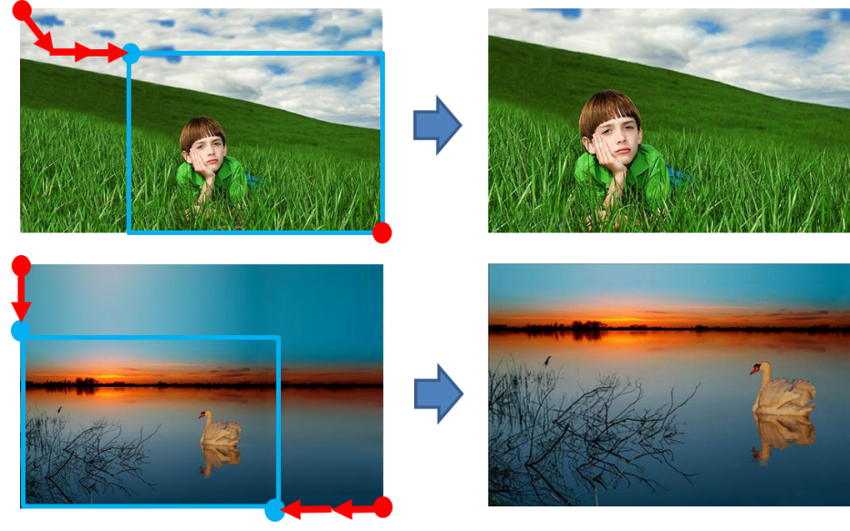

# Photo Recomposition Using Repeated Cropping #

## Introduction ##
Repeated cropping is used to enhance the aesthetic quality of a photograph in terms of image composition.  

This project uses a Convolutional Neural Network (CNN) to dictate iterative image cropping in order to improve the image composition. This automatic cropping is able to follow specific composition guidelines, such as the rule of thirds and the salient object size. 

For more details regarding this technique, please refer to http://sunw.csail.mit.edu/abstract/CNN_based_Repeated.pdf  
  
* Examples of repeated cropping procedure  
  
* Framework of repeated cropping  


## Files ##
* [main_using_saliency.lua](Repeated%20Cropping/main_using_saliency.lua) : Training Code
* [inference_dir.lua](Repeated%20Cropping/inference_dir.lua) : Test Code

\* Trained model will be uploaded later

## Requirements ##
* Linux OS
* Torch7
  * Installation guide in [English](http://www.jetsonhacks.com/2015/05/20/torch-7-scientific-computer-framework-with-cudnn-nvidia-jetson-tk1/) and [Korean](http://www.whydsp.org/279)

## Licence ##

This software is being made available for research purpose only. Check [LICENSE](LICENSE) file for details.  
  
If you use this code in a publication, please cite our paper.  
  
```
    @inproceedings{hong2017cnnbased,
       title     = {CNN based Repeated Cropping for Photo Composition Enhancement},
       author    = {Eunbin Hong, Junho Jeon, and Seungyong Lee},
       booktitle = {CVPR},
       year      = {2017}
    }
```

## Contact ##
Eunbin Hong (hong5827 [at] postech [dot] ac [dot] kr)


## Coupe Project Links ##
* [Coupe Website](http://coupe.postech.ac.kr/)
* [POSTECH CG Lab.](http://cg.postech.ac.kr/)
